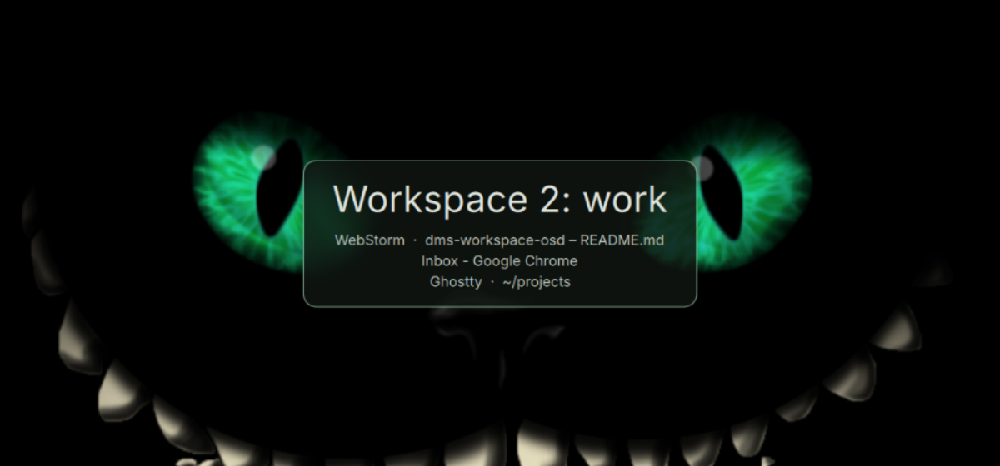

# Workspace OSD Flash

A [DankMaterialShell](https://github.com/AvengeMedia/DankMaterialShell) daemon plugin that briefly shows the id and name of the workspace you just switched to, centered on that screen.

<p align="center">
  
</p>

## Features

- Centered card with the workspace number and, if it has one, its name
- Small list underneath with the windows open on that workspace, one per line as `App · Window title` (or grouped app names), folding the rest into `+N more`
- Shown on the screen whose workspace changed, so it works per monitor
- Quick switching never queues: a new switch replaces the text immediately
- Fades and shrinks out after a configurable hold time
- Click-through overlay, never steals focus or input
- Styled like DMS's own OSDs: theme colours, corner radius, popup transparency, elevation shadow, blur and blur border, font family and size, animation speed, light/dark mode
- Configurable from the DMS settings UI: hold time, fade duration, text size, name on/off, label style, position
- Translatable; ships with Dutch

## Requirements

- DankMaterialShell >= 1.6.0 (uses the plugin translation API introduced in 1.6.0)
- Hyprland or niri
  - Hyprland: tested
  - niri: best effort, implemented against the DMS niri service but not tested yet. Feedback welcome.

A startup check refuses to enable the plugin on other compositors and shows the reason as a toast.

## Install

### From the plugin registry

DMS Settings (`Mod + ,`) → **Plugins** → **Browse** → *Workspace OSD Flash*, or:

```sh
dms plugins install workspaceOsdFlash
```

Update later with `dms plugins update workspaceOsdFlash`; remove with `dms plugins uninstall workspaceOsdFlash`.

### Manual

```sh
git clone https://github.com/AleBles/dms-workspace-osd \
  ~/.config/DankMaterialShell/plugins/workspace-osd-flash
dms restart
```

Then enable it in **DMS Settings → Plugins → Workspace OSD Flash**, or run `dms ipc call plugins enable workspaceOsdFlash`.

Clone rather than symlink: with a symlinked plugin directory Qt refuses to load the startup check (`File name case mismatch` in the DMS log). DMS then skips the check and loads the plugin anyway, so this only matters for development setups.

## Settings

| Setting | Default | Notes |
|---|---|---|
| Hold time | 700 ms | Time before the fade-out starts |
| Fade-out duration | follows DMS | Set a value in ms to override the DMS animation speed |
| Accent border | on | Thin primary-coloured ring on top of the DMS surface |
| Text size | 44 px | The card scales with the text |
| Show workspace name | on | Include the name when the workspace has one |
| List open windows | on | One small line per window under the label |
| App lines show | Window titles | `App · Title`, or app names grouped with a count |
| App lines alignment | Left | Left-aligned block under the label, or centered lines |
| Max characters per line | 100 | Longer lines are cut with an ellipsis, 0 disables |
| Max lines | 6 | Further windows fold into `+N more` |
| Label style | `Workspace 2: work` | Also `2 · work` and name-only |
| Position | center | Center, top or bottom of the screen |

## Naming workspaces

On Hyprland the DMS rename dialog (`Ctrl + Shift + R` by default) stores the name as `<id> <name>`. The plugin strips the duplicated id, so a workspace renamed to `work` shows as **Workspace 2: work**.

On niri the number shown is the workspace's index on its output, the same number the DMS bar shows.

## IPC

Other tools can flash a message on a screen. Quickshell IPC requires every argument, so pass `""` for the ones you do not need:

```sh
dms ipc call wsosd flash "Hello" "DP-1" "line one | line two"   # text, monitor ("" = all screens), lines ("" = none)
dms ipc call wsosd flash "Hello" "" ""
dms ipc call wsosd hide
```

## Translations

The plugin ships Dutch (`translations/nl.json`); the English strings in the QML files are the source. DMS picks the file matching the shell locale automatically.

To add a language, create `translations/<locale>.json` (`de.json`, `zh_CN.json`, ...) with one bucket per English term:

```json
{
  "Hold time": { "Hold time": "Anzeigedauer" }
}
```

Untranslated terms fall back to English. Reload with `dms ipc call plugins reload workspaceOsdFlash` and switch the language under **DMS Settings → Locale** to check. Pull requests with new languages are welcome.

## License

[MIT](LICENSE)
